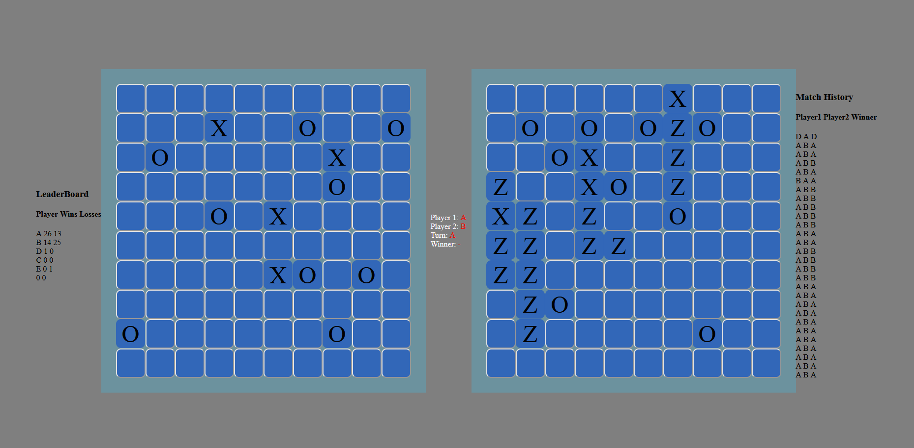

Online Battleship Project
=========================

## Overview

Interview assignment turned into a full project. Originally, I was meant to make the basic data structures and logic for a battleship game to talk about during an interview. It took about 2 hours to finish that assignment and I had a few days before the actual interview, this was the outcome.

A Spring Boot frame work was added so I could play the game locally on my browser. Websockets allows for active communication between the server and 2 players. Users and Matches are kept in a MySQL database so that I can make the Leaderboard and Match History. The frontend server was made with Javascript, HTML, and CSS while the game server was made with Java.
